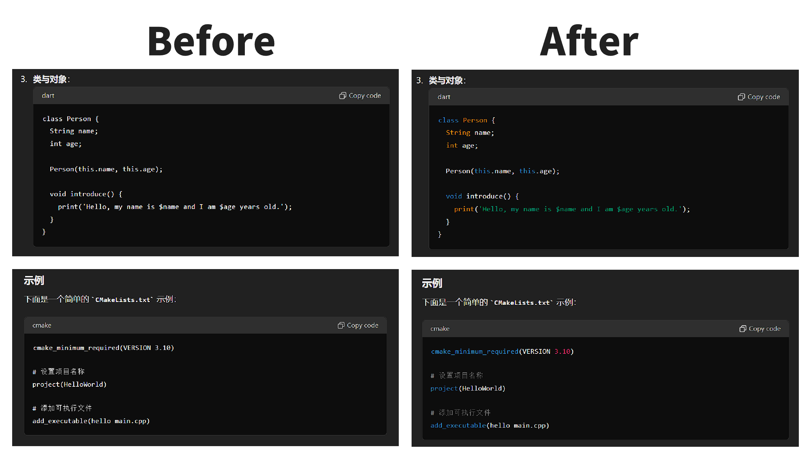

# ChatGPTCodeHighlight

为 ChatGPT 编写的所有语言代码增加高亮显示。
支持 [Highlight.js](https://highlightjs.org/) 所有的 192 种语言，与 ChatGPT 主题保持一致。

## GitHub

- 地址：[https://github.com/Dreace/ChatGPTCodeHighlight](https://github.com/Dreace/ChatGPTCodeHighlight)

## 安装

- Chrome 推荐使用扩展：「[Tampermonkey](https://chrome.google.com/webstore/detail/dhdgffkkebhmkfjojejmpbldmpobfkfo)」
- Firefox 推荐使用扩展：「[Greasemonkey](https://addons.mozilla.org/en-US/firefox/addon/greasemonkey/)」
- 脚本地址：[https://greasyfork.org/scripts/393096-ChatGPTCodeHighlight](https://greasyfork.org/scripts/393096-ChatGPTCodeHighlight)

## 使用

1. 使用「安装」中提到的任意一个插件安装脚本
2. 打开 [https://chatgpt.com/](https://chatgpt.com/) 进行对话
3. 查看代码高亮效果

Add syntax highlighting to all language codes written for ChatGPT. Supports all 192 languages of [Highlight.js](https://highlightjs.org/) and maintains consistency with the ChatGPT theme.

## GitHub

- Repository: [https://github.com/Dreace/ChatGPTCodeHighlight](https://github.com/Dreace/ChatGPTCodeHighlight)

## Installation

- For Chrome, it is recommended to use the extension: "[Tampermonkey](https://chrome.google.com/webstore/detail/dhdgffkkebhmkfjojejmpbldmpobfkfo)"
- For Firefox, it is recommended to use the extension: "[Greasemonkey](https://addons.mozilla.org/en-US/firefox/addon/greasemonkey/)"
- Script URL: [https://greasyfork.org/scripts/393096-ChatGPTCodeHighlight](https://greasyfork.org/scripts/393096-ChatGPTCodeHighlight)

## Usage

1. Install the script using any of the plugins mentioned in the "Installation" section.
2. Open [https://chatgpt.com/](https://chatgpt.com/) and start a conversation.
3. Observe the code highlighting effect.
